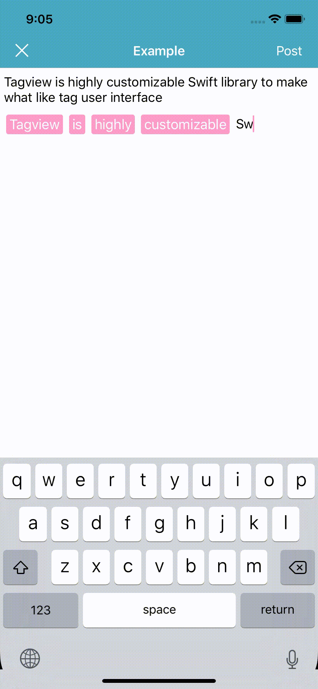
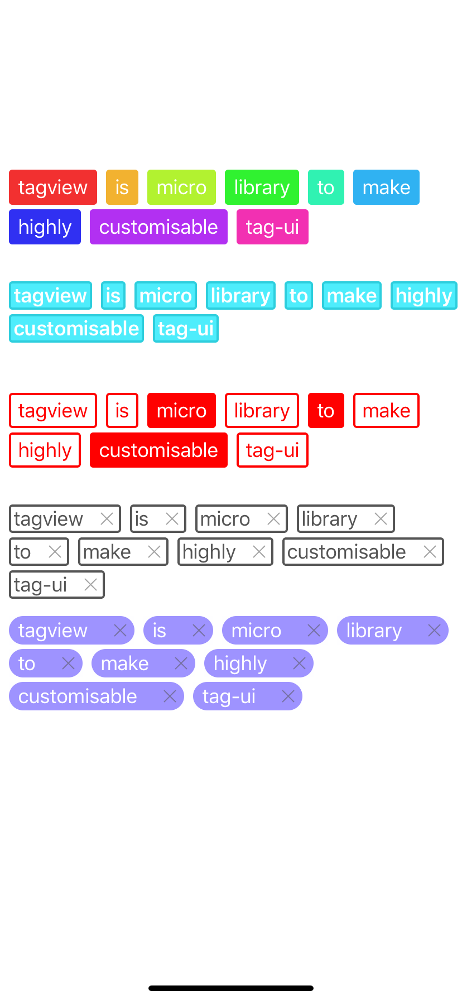

# TagFieldView

[](https://travis-ci.org/churabou/TagFieldView)
[](https://cocoapods.org/pods/TagFieldView)
[](https://cocoapods.org/pods/TagFieldView)
[](https://cocoapods.org/pods/TagFieldView)

## Example

<table>
   <tr>
     <th>TagField</th>
     <th>TagListView</th>
  </tr>
  <tr>
    <td></td>
    <td></td>
  </tr>
</table>

To run the example project, clone the repo, and run `pod install` from the Example directory first.

## Requirements

## Installation

TagFieldView is available through [CocoaPods](https://cocoapods.org). To install
it, simply add the following line to your Podfile:

```ruby
pod 'TagFieldView'
```

## Author

churabou, ginga7888@gmail.com

## License

TagFieldView is available under the MIT license. See the LICENSE file for more info.
